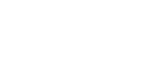
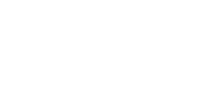
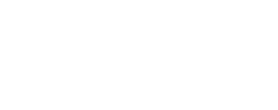

# O Projeto Comando
###### de aluno para aluno
Um Projeto de Extensão da UTFPR, campus Ponta Grossa, com a missão de transmitir ensino técnico de qualidade para todos os apreciadores da programação no Brasil.

O Comando disponibiliza cursos de programação com um toque especial: não se limitar a uma explicação monótona e robotizada. A didática usa de animações ricas e conteúdo técnico aprofundado, a união da clareza para os conceitos abstratos da programação com recursos didáticos atrativos para melhor compreensão dos estudantes.

  

# Tecnologias que usamos

  
  

 
  

  
  

  

  
  

---

  

